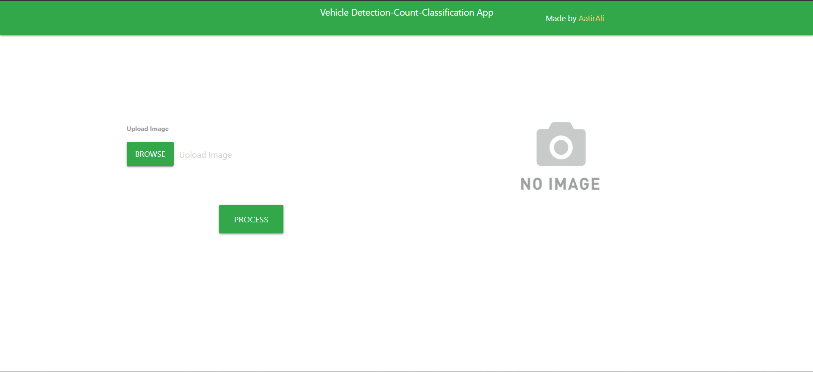
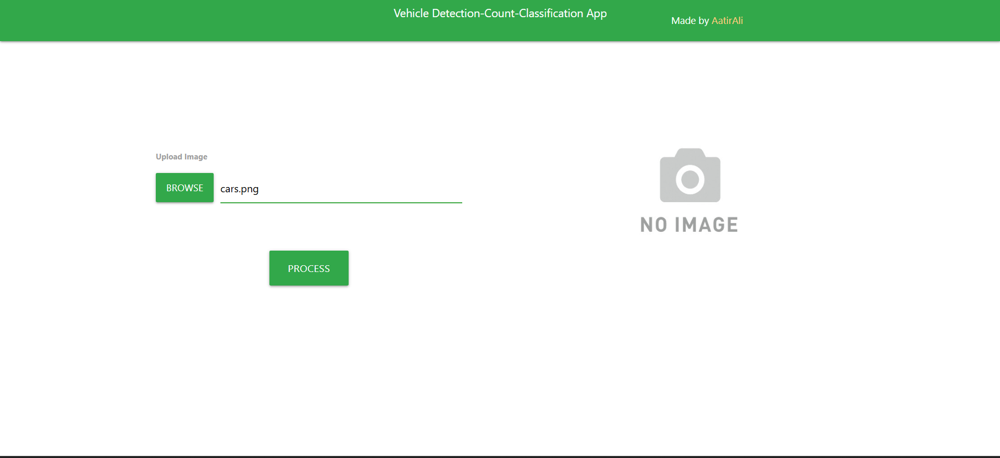
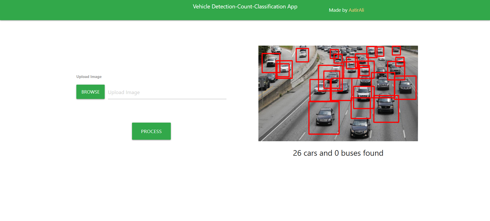

# 🚗 Detect and Count Vehicle (Computer Vision Project)

This project is a **Flask-based Machine Learning web application** that **detects and counts vehicles** from images using **Computer Vision techniques**.

The application is deployed online using **Render** and can be accessed through a web browser.

🔗 **Live Demo:**  
https://detect-and-count-vehicle.onrender.com

🔗 **GitHub Repository:**  
https://github.com/exp0nent/Detect-and-Count-Vehicle

---

## 📌 Project Objective

The main goal of this project is to:
- Detect vehicles in an image
- Count the number of detected vehicles
- Display the results through a web interface

This project helps in understanding how **Machine Learning models can be integrated with Flask** and deployed on cloud platforms.

---

## ✨ Features

- Upload image from browser
- Vehicle detection using Computer Vision
- Automatic vehicle counting
- Result displayed on web page
- Simple and user-friendly UI
- Deployed on cloud (Render)

---

## 🧠 Machine Learning & Computer Vision Explanation

- The project uses **OpenCV** for image processing.
- A **pre-trained vehicle detection model / Haar Cascade / CV technique** is used to identify vehicles.
- Detected objects are bounded using bounding boxes.
- The total number of detected vehicles is counted and displayed.

📌 This approach is commonly used in:
- Traffic monitoring systems
- Smart city applications
- Surveillance systems

---

## 🛠️ Tech Stack

- **Python**
- **Flask**
- **OpenCV**
- **Machine Learning / Computer Vision**
- **HTML, CSS**
- **Gunicorn**
- **Render (Cloud Deployment)**

---
## 📂 Project Structure

Detect-and-Count-Vehicle/
│
├── app.py # Main Flask application
├── requirements.txt # Project dependencies
├── Procfile # Render deployment config
├── static/ # CSS, images, assets
├── templates/ # HTML templates
└── README.md # Documentation
---
---

## 🖼️ Screenshots
### Home Page


### Image Upload


### Detection Result


---


## 🚀 How to Run Locally 

### 1️⃣ Clone the repository 
```bash 
etect-and-Count-Vehicle.git
cd Detect-and-Count-Vehicle
```
### 2️⃣ Create virtual environment (optional but recommended)

python -m venv venv
source venv/bin/activate   # On Windows: venv\Scripts\activate

### 3️⃣ Install dependencies
pip install -r requirements.txt

### 4️⃣ Run the Flask app
python app.py

### 5️⃣ Open in browser
http://127.0.0.1:5000/

---

#### ☁️ This project is deployed on Render (Free Plan).

---

### Deployment Steps: 

Code pushed to GitHub   
Render connected to GitHub repository   
Python runtime selected   
 
### Build command:   
pip install -r requirements.txt   

### Start command: 
gunicorn app:app 

---

## 📌 Note: 
On free plan, the application goes to sleep after inactivity and takes ~50 seconds to restart.   

---

### 🎯 Use Cases  

Academic mini project   
Computer Vision practice   
Flask deployment learning    
ML portfolio project   
Interview demonstration project   

---

## ⚠️ Limitations 
Detection accuracy depends on image quality   
Free hosting has cold-start delay   
Not optimized for real-time video processing   

--- 

## 🔮 Future Improvements

Real-time vehicle detection using video  
YOLO / Deep Learning-based detection  
Vehicle classification (car, bike, bus, truck)  
Database to store detection results  

---

## 🤝 Contribution  

Contributions are welcome!  
Fork the repository   
Create a new branch   
Submit a pull request 

---

### 📧 Contact 
For queries or suggestions, feel free to connect.   
